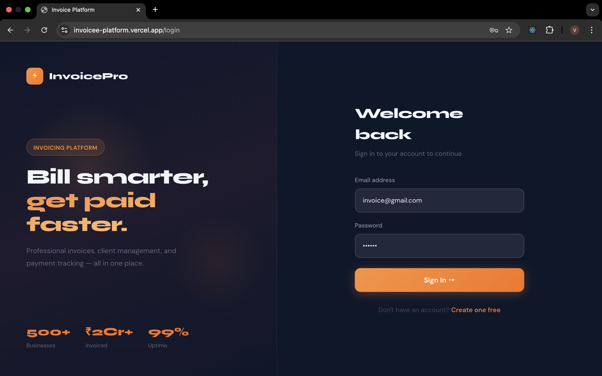
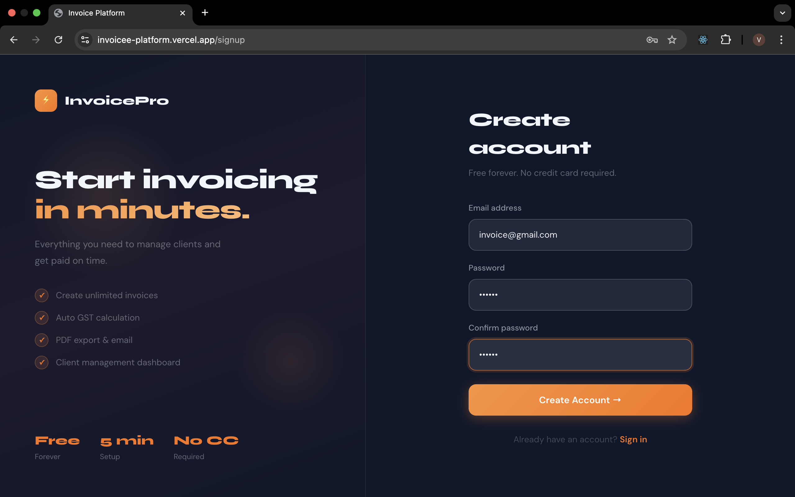
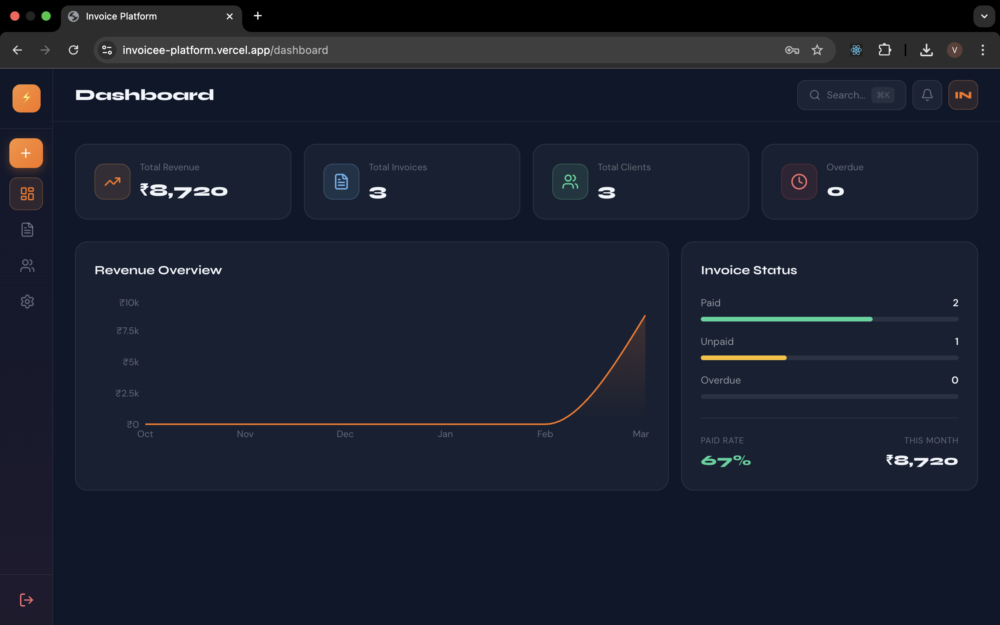
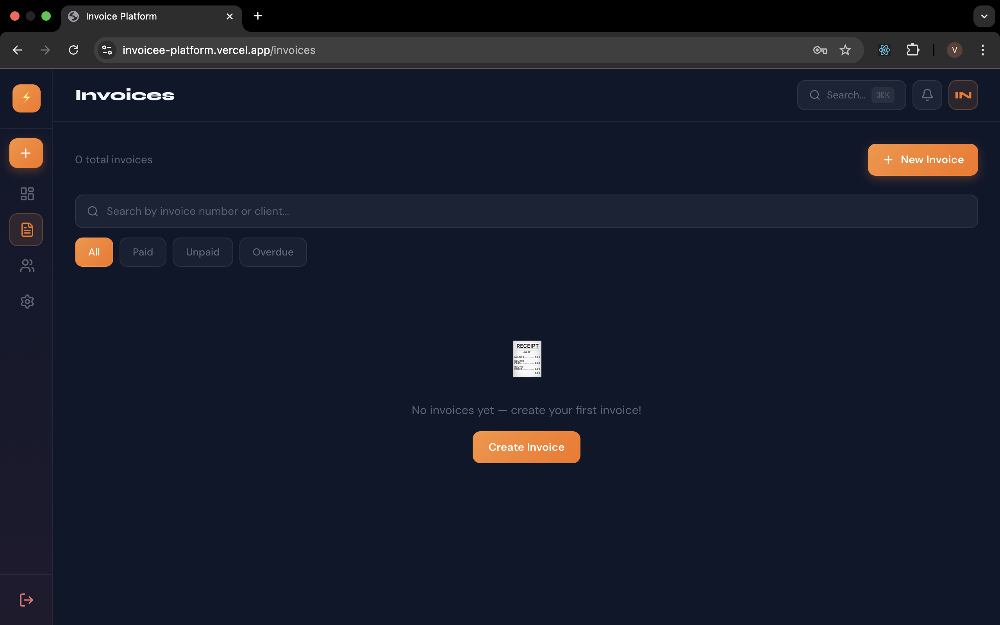
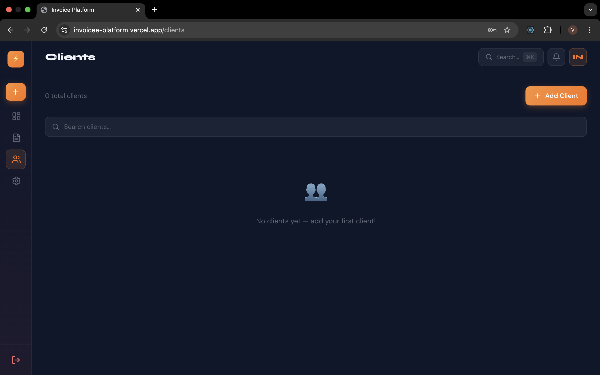
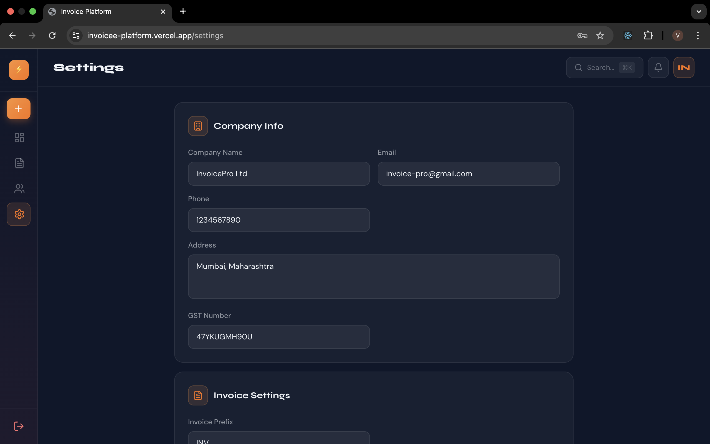

<div align="center">

<br/>

```
██╗███╗   ██╗██╗   ██╗ ██████╗ ██╗ ██████╗███████╗
██║████╗  ██║██║   ██║██╔═══██╗██║██╔════╝██╔════╝
██║██╔██╗ ██║██║   ██║██║   ██║██║██║     █████╗  
██║██║╚██╗██║╚██╗ ██╔╝██║   ██║██║██║     ██╔══╝  
██║██║ ╚████║ ╚████╔╝ ╚██████╔╝██║╚██████╗███████╗
╚═╝╚═╝  ╚═══╝  ╚═══╝   ╚═════╝ ╚═╝ ╚═════╝╚══════╝
```

### **Invoice & Billing Platform for Freelancers & Small Businesses**

*Create professional invoices · Track payments · Manage clients — all in one place.*

<br/>

[](https://nextjs.org)
[](https://supabase.com)
[](https://typescriptlang.org)
[](https://tailwindcss.com)
[](https://ui.shadcn.com)
[](https://zustand-demo.pmnd.rs)

<br/>

</div>

---

## ✦ Features

| | Feature | Description |
|:---:|:---|:---|
| 📊 | **Revenue Dashboard** | Real-time charts, revenue stats, and financial overview at a glance |
| 🧾 | **Invoice Builder** | Add line items, apply discounts, and auto-calculate taxes instantly |
| 📄 | **PDF Export** | One-click professional PDF download — ready to send to clients |
| 👥 | **Client Manager** | Full CRUD operations, smart search, and GST/tax ID support |
| 💰 | **Payment Tracking** | Visual status for every invoice — Paid / Unpaid / Overdue |
| 🔐 | **Auth + RLS** | Supabase Auth with Row-Level Security — your data stays yours |
| ⚙️ | **Settings** | Customize company info, preferred currency, and payment terms |
| 📱 | **Responsive Design** | Optimized for desktop, tablet, and mobile |

---

## 🏗️ Tech Stack

| Layer | Technology |
|:---|:---|
| **Framework** | Next.js 15 (App Router) |
| **Language** | TypeScript |
| **Styling** | Tailwind CSS |
| **Database** | Supabase (PostgreSQL) |
| **Auth** | Supabase Auth with RLS |
| **PDF Generation** | React-PDF / jsPDF |
| **Charts** | Recharts |
| **Deployment** | Vercel |

---


## 📸 Screenshots

<div align="center">

### 🔐 Auth
| Login | Signup |
|-------|--------|
|  |  |

### 📊 Dashboard


### 🧾 Invoices
| Invoice List | Add Invoice | Invoice Created |
|-------------|-------------|-----------------|
|  |  |  |

### 👥 Clients
| Client List | Add Client |
|------------|------------|
|  |  |

### 📄 PDF Export
| Download | Downloaded |
|----------|------------|
|  |  |

### ⚙️ Settings & Notifications
| Settings | Notifications | Profile |
|---------|---------------|---------|
|  |  |  |

</div>

---


## 🙋 FAQ

**Can I use this for free?**
Yes — the app is open source. Host it yourself using the free tiers of Vercel and Supabase.

**Is my data secure?**
All data is isolated per user via Supabase Row-Level Security. Nobody else can access your invoices.

**Does it support GST?**
Yes — client profiles support GST numbers and tax is auto-calculated in the invoice builder.

---

> *Invoice Platform — making billing less painful for independent builders.*
