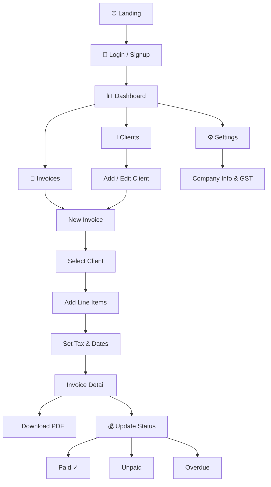

 

# ⚡ InvoicePro

### Bill smarter. Get paid faster.

A full-stack Invoice & Billing platform for freelancers and small businesses —
create professional invoices, track payments, and manage clients with a sleek dark UI.

 

---

## ✨ Features

| | Feature | Description |
|---|---|---|
| 📊 | **Revenue Dashboard** | Charts, stats, revenue overview |
| 🧾 | **Invoice Builder** | Line items, auto tax calculation |
| 📄 | **PDF Export** | One-click professional PDF download |
| 👥 | **Client Manager** | Full CRUD, search, GST support |
| 💰 | **Payment Tracking** | Paid / Unpaid / Overdue status |
| 🔐 | **Auth + RLS** | Supabase Auth with row-level security |
| ⚙️ | **Settings** | Company info, currency, payment terms |
| 📱 | **Responsive** | Works on all screen sizes |

---

## 🏗️ Architecture

| Browser | API Layer | Supabase |
|---------|-----------|---------|
| Next.js App Router | `/api/invoices` | Auth Service |
| Zustand — State | `/api/clients` | `clients` table |
| shadcn/ui — Components | `middleware.ts` | `invoices` table |
| Recharts — Charts | Route protection | `invoice_items` table |
| jsPDF — PDF Export | Auth check | RLS Policies ✓ |

---

## 🛠️ Tech Stack

| Layer | Technology | Purpose |
|-------|-----------|---------|
| 🖼️ Framework | Next.js 16 (App Router) | Full-stack React framework |
| 🔷 Language | TypeScript | Type safety throughout |
| 🎨 Styling | Tailwind CSS + shadcn/ui | UI components & design |
| 🗄️ Database | Supabase (PostgreSQL) | Data storage |
| 🔐 Auth | Supabase Auth | Email/password login |
| 📄 PDF | jsPDF + jspdf-autotable | Invoice PDF generation |
| 📊 Charts | Recharts | Dashboard charts |
| 🗃️ State | Zustand | Client-side state |
| 🚀 Deploy | Vercel *(coming soon)* | Hosting & CI/CD |

---

## 🔄 User Flow

---

## 📅 Build Log

| Date | What was built |
|------|---------------|
| Mar 6 | Project setup · Supabase schema · Auth (Login/Signup) |
| Mar 7 | Sidebar · Navbar · Dashboard · Layout |
| Mar 10 | Client Manager · CRUD · API routes |
| Mar 11 | Invoice List · Builder · Detail page · API |
| Mar 12 | Settings page (company info, GST, currency) |
| Mar 13 | PDF export with jsPDF |

---

## 🚧 Roadmap

- [x] Authentication
- [x] Dashboard with charts
- [x] Client Manager
- [x] Invoice Builder
- [x] PDF Export
- [x] Settings
- [ ] Responsive Design
- [ ] Docker
- [ ] CI/CD (GitHub Actions)
- [ ] Deploy to Vercel
